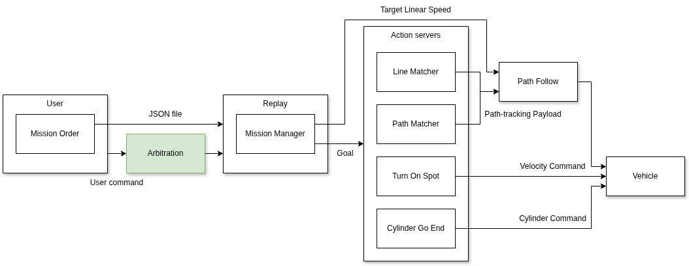

# nav_arbitration

Supervisor of the autonomous navigation stack. It runs a YASMIN state machine that drives lifecycle transitions of managed nodes from operator commands (`/auto/conductor_cmd`), replay status and vehicle status. It publishes the active drive mode on `/auto/conductor_state` and declares navigation parameters read remotely by `nav_line_matcher`, `nav_path_matcher`, `nav_turn` and `nav_replay`. Group transitions use `nav_lifecycle_manager`.

## Overview

On each state-machine cycle (10 Hz):

1. Refresh the blackboard from `conductor_cmd`, `replay_status` and `vehicle_status`.
2. Evaluate whether a transition is allowed from the current state.
3. On transition, drive managed nodes to the required lifecycle primary state.

In parallel, a timer (period `rate`) publishes the current drive mode on `/auto/conductor_state`.

The action-server group is transitioned through `LifecycleManager`. Replay, geofencing, recorder and `json_agri_format_parser` are transitioned individually through `LifecycleServiceClient` instances.

If a group transition fails, affected nodes are rolled back to their previous state and the transition is not taken.

## State machine

| State             | Lifecycle meaning            | Description                                             |
| ----------------- | ---------------------------- | ------------------------------------------------------- |
| `unconfigured`    | `PRIMARY_STATE_UNCONFIGURED` | Idle / teleop. Action servers inactive, recorder active |
| `replay_inactive` | `PRIMARY_STATE_INACTIVE`     | Replay configured but paused, ready to start            |
| `replay_active`   | `PRIMARY_STATE_ACTIVE`       | Replay running, action servers active                   |

| From              | Outcome            | To                | Trigger (summary)                                                    |
| ----------------- | ------------------ | ----------------- | -------------------------------------------------------------------- |
| `unconfigured`    | `replay_configure` | `replay_inactive` | `drive_mode == DRIVE_REPLAY`, no `restart`, vehicle status OK        |
| `replay_inactive` | `activate`         | `replay_active`   | Not paused, not restart, replay and vehicle status OK                |
| `replay_inactive` | `cleanup`          | `unconfigured`    | `restart`, mode change, or vehicle error past emergency-stop timeout |
| `replay_active`   | `deactivate`       | `replay_inactive` | `pause`, end of path, remote e-stop or bumper warning                |
| `replay_active`   | `cleanup`          | `unconfigured`    | `restart`, mode change or vehicle error                              |
| `unconfigured`    | `shutdown`         | (terminal)        | `rclcpp` shutdown while in `unconfigured`                            |

## Managed nodes

Action-server group (via `LifecycleManager`, list order):

| Node                                        | Role                |
| ------------------------------------------- | ------------------- |
| `/auto/line/matcher`                        | Line matcher server |
| `/auto/line/follower`                       | Path follower       |
| `/auto/turn/on_spot`                        | Turn-on-spot server |
| `/auto/path/matcher`                        | Path matcher server |
| `/auto/path/follower`                       | Path follower       |
| `/auto/working_zone_action/cylinder_go_end` | Cylinder GO/END     |

Individually managed (via `LifecycleServiceClient`):

| Node                                      | Role                    |
| ----------------------------------------- | ----------------------- |
| `/auto/replay`                            | Mission replay          |
| `/auto/recorder`                          | Path recorder           |
| `/safety/geofencing/geofencing_publisher` | Geofencing              |
| `/auto/json_agri_format_parser`           | Agri JSON format parser |

## Parameters

| Parameter                                          | Default           | Description                                                  |
| -------------------------------------------------- | ----------------- | ------------------------------------------------------------ |
| `rate`                                             | `0.3`             | Period (s) of the `conductor_state` publishing timer         |
| `timeout_end_emergency_stop`                       | `8.0`             | Delay (s) after emergency stop ends before replay may resume |
| `lateral_deviation_max`                            | `0.4`             | Max lateral deviation (m), served to navigation nodes        |
| `lateral_deviation_max.in_working_zone`            | `0.4`             | Max lateral deviation inside working zone (m)                |
| `lateral_deviation_max.out_working_zone`           | `0.6`             | Max lateral deviation outside working zone (m)               |
| `lateral_deviation_max.uturn`                      | `1.5`             | Max lateral deviation during U-turn (m)                      |
| `course_deviation_max`                             | `π/8`             | Max course deviation (rad), served to navigation nodes       |
| `speed_working_zone_added`                         | `0.0`             | Extra speed inside working zone (m/s)                        |
| `working_zone_action.name`                         | `cylinder_go_end` | Working-zone action server name                              |
| `working_zone_action.offset_distance_at_the_start` | `0.0`             | Tool activation offset at working-zone start (m)             |
| `working_zone_action.offset_distance_at_the_end`   | `0.0`             | Tool deactivation offset at working-zone end (m)             |
| `loop_back.return_speed`                           | `0.0`             | Return speed on loop-back segments (m/s)                     |

Downstream nodes read the navigation and mission parameters remotely from `/auto/arbitration`.

## Topics

| Topic                   | Type                           | Direction | Description                                    |
| ----------------------- | ------------------------------ | --------- | ---------------------------------------------- |
| `/auto/conductor_cmd`   | `nav_interfaces/msg/Conductor` | In        | Operator command (drive mode, pause, restart)  |
| `replay/status`         | `std_msgs/msg/UInt64`          | In        | Replay status bitmask from `nav_replay`        |
| `/vehicle/status`       | `std_msgs/msg/UInt64`          | In        | Vehicle status bitmask                         |
| `/auto/conductor_state` | `nav_interfaces/msg/Conductor` | Out       | Current drive mode reflecting the active state |

`/auto/conductor_cmd` uses best-effort QoS.

`Conductor` fields:

| Field        | Values                                 | Description                     |
| ------------ | -------------------------------------- | ------------------------------- |
| `drive_mode` | `DRIVE_TELEOP` (0), `DRIVE_REPLAY` (1) | Requested or current drive mode |
| `pause`      | `bool`                                 | Pause the current mission       |
| `restart`    | `bool`                                 | Request a full reset to teleop  |

Vehicle status bitmask (`/vehicle/status`):

| Range           | Examples                                                                                       |
| --------------- | ---------------------------------------------------------------------------------------------- |
| Info `[0-15]`   | `normal_operation`                                                                             |
| Warn `[16-31]`  | `warn_emergency_stop`, `warn_emergency_stop_remote`, `warn_bumper`                             |
| Error `[32-63]` | `error_udp_driver`, `error_battery`, `error_cylinder`, `error_vcu`, `error_motor`, `error_imu` |

Any error bit (`>= 1 << 32`) blocks activation and forces a return to `unconfigured`. Remote e-stop and bumper warnings deactivate replay until cleared and `timeout_end_emergency_stop` has elapsed.
